# Analyzing Energy Risk in a Changing Winter Environment

**Location**: MISO with emphasis on Minnesota
**Data Sources**: MISO Pricing API, MISO Generation API, MISO FTR Annual Auction Summary, MISO RTDIP, KMSP Weather Station

---

## Executive Summary

[View Executive Presentation (PDF)](presentation/analyzing-risk-executive.pdf)

This analysis examines climate risk and profit and loss of Financial Transmission Rights (FTRs) under baseline and extreme scenarios using case studies relevant to Great River Energy (GRE). It also discusses considerations for FTR purchase strategy in an evolving landscape. The project has four stages: 

1. Documenting Minnesota's changing winter weather patterns and the impact on generation.
2. Demonstrating how extreme weather events translate into extreme market outcomes through case studies of Winter Storm Uri (2021) and the most recent January 2026 cold snap. 
3. Examining FTR profit and loss under normal versus extreme market conditions. 
4. Discussing high-level implications for hedging strategy.

The goal is not to prescribe a specific strategy as that requires more information about a given utility's risk tolerance, regulatory framework, and stakeholder priorities. This project serves to inform on risk and analyze profit and loss behavior, particularly during the extreme winter events where losses concentrate.

---

## Part 1: Understanding the Evolving Winter Energy Landscape

### Minnesota's Changing Winter Climate

People most often associate climate change with rising temperatures, which we also see when comparing the last eight (2018-2026) Minnesota winters to the previous eight (2009-2017). However citing the average temperature fails to convey what is happening at the tails of the distribtion, which is critical from a risk perspective. Skewness is used to measure the tail of a distribution. Negative skewness indicates more cold weather events. This analysis shows that skewness has become pronouncedly more negative over recent years. This leads to the counterintuitve realization that while average temperature is rising, extreme cold snaps are actually becoming more severe.

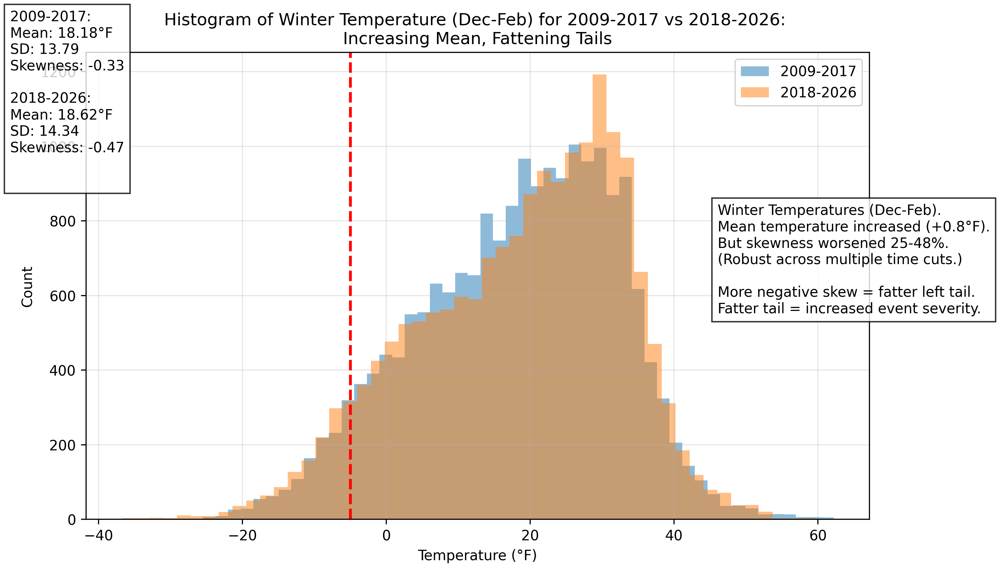

At the same time winter wind patterns are also changing. In this case average wind speed is decreasing. Skewness increased in the opposite direction meaning more severe high winds, but more importantly for energy providers an increased frequency of low wind hours. 

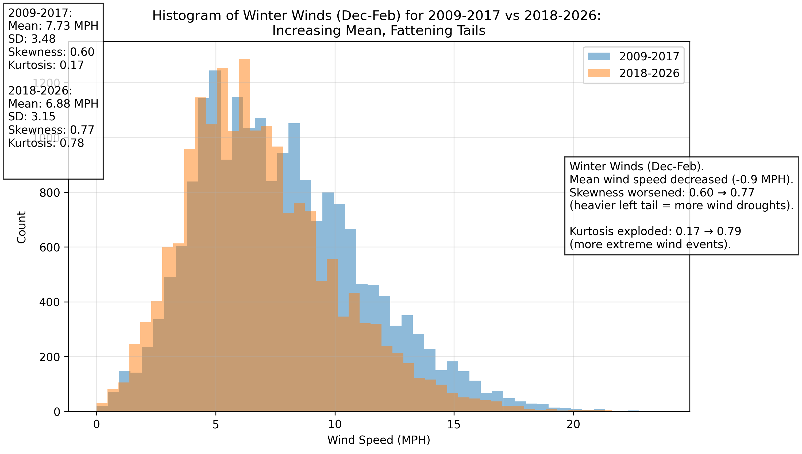

The data clearly points to two distinct and important trends in Minnesota's winter climate: First, the average temperature is warming but with increased variability and severity of extreme cold. Second, average wind is decreasing with more total low wind hours. This combination can have an outsized impact on energy prices as we will examine next. 

To understand how weather affects market risk, it's important to briefly explain how electricity prices work in MISO. The grid operator runs a market where generators offer to supply power at various prices. The lowest-cost resources (wind, solar, nuclear, coal baseload) are dispatched first, with more expensive generators called upon only when demand is high or when cheaper resources are unavailable.

Electricity prices are determined by locational marginal pricing (LMP) - the cost of serving one additional megawatt (MW) of demand at a given location on the grid. During normal conditions, LMPs reflect routine congestion and fuel costs. During extreme events, prices can spike if infrastructure freezes, natural gas gets diverted to heating, and transmission congestion occurs and power can't flow to where it's needed.

Wind generation plays a critical role here. During normal winter conditions, abundant wind keeps prices low by reducing reliance on gas-fired generation. But during extreme cold events, if wind output drops when there is high heating demand and gas generator outages, prices can spike dramatically.

The plot below illustrates this relationship. Each point represents an hour at a node, with temperature on the X-axis and real-time electricity prices on the Y-axis. Points are colored by wind generation levels - blue dots mean less wind generation is occuring and red dots are high generation. The clustering of extreme prices occurs when very cold temperatures coincide with low wind generation.

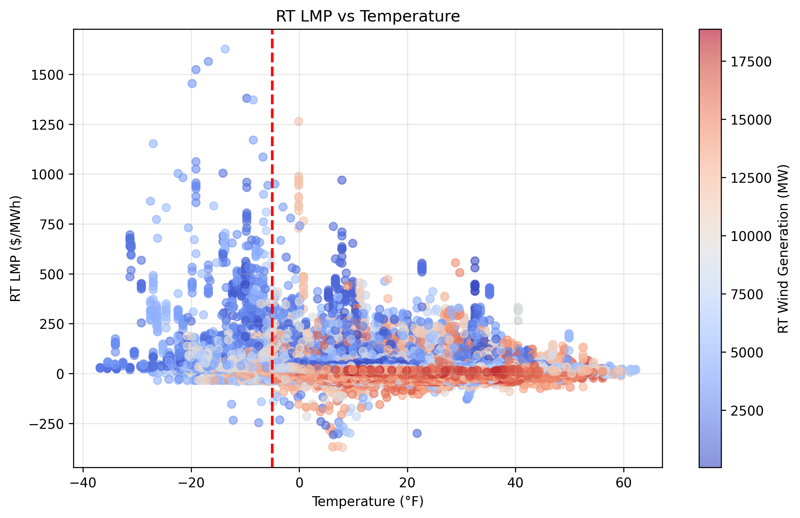

It is worth noting while studies based on more dated climate data suggest wind power is resilient to extreme weather these findings are in line with a UK paper published by the Royal Meteorological Society【1】. That paper also voiced concern about severe compound events of low wind and cold temperature in the British power system. This analysis observes a similar trend with Minnesota winters.

## Part 2: Case Studies of Extreme Weather Impact on Real-Time Prices

This section will examine how extreme weather can spike real-time energy prices. For this analysis we will focus on two nodes - WAUE and GRE.AZ. WAUE is an interface node representing the MISO-SPP border, where prices reflect the cost of moving power across transmission lines connecting the two markets. GRE.AZ is a hub node - a weighted average of prices at physical locations throughout the Great River Energy service area. These nodes were chosen for a case study because of their interesting price behavior discovered in exploratory data analysis and because GRE purchased a large FTR flowing from WAUE to GRE.AZ for the 2025 winter season. Importantly, WAUE reflects MISO's overall generation mix (15% wind), while GRE.AZ represents a wind-heavy region (GRE is 44% wind and renewables per its 2024 annual report【2】). This resource mix asymmetry becomes critical during extreme weather events.

As suggested by the climate histograms above, Minnesota had experienced a run of subdued weather and grid normalcy by today's standards leading up to winter 2020-2021. Winter storm Uri occurred from February 13 to 17, 2021 and was extreme and memorable in every sense. In Minnesota temperatures dipped as low as -27°F. Texas and much of the central United States experienced their lowest temperatures in over a century. This caused rolling blackouts across Texas and SPP in addition to record natural gas prices natural gas pipelines had not been winterized for such extreme conditions. Natural gas is a key part of the energy stack so real-time (RT) MISO prices also spiked to new highs. 

The plot below demonstrates the LMP for both RT and day-ahead (DA) prices. RT prices reflect actual conditions and can diverge significantly from DA forecasts during extreme weather. Leading into Uri natural gas produced on schedule. Both DA and RT prices were elevated but not extreme. Then as conditions worsened gas supplies were constrained and production dipped below the DA demand amount. So as transmission froze over gas could not get to where it was needed to go, extreme scarcity arose, and RT prices spiked above $1600/MWh. This signals a direct relationship and high dependency between natural gas and energy prices at WAUE.

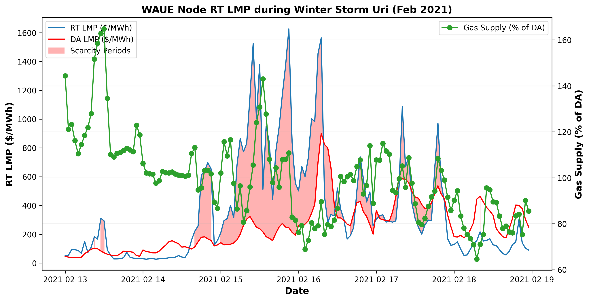

Prices also spiked to extremes at the GRE.AZ node. The plot shows the same gas constraint relationship reflected above with prices going as high as $900 MW/h. This is considerably less than WAUE LMP but devastating nonetheless. 

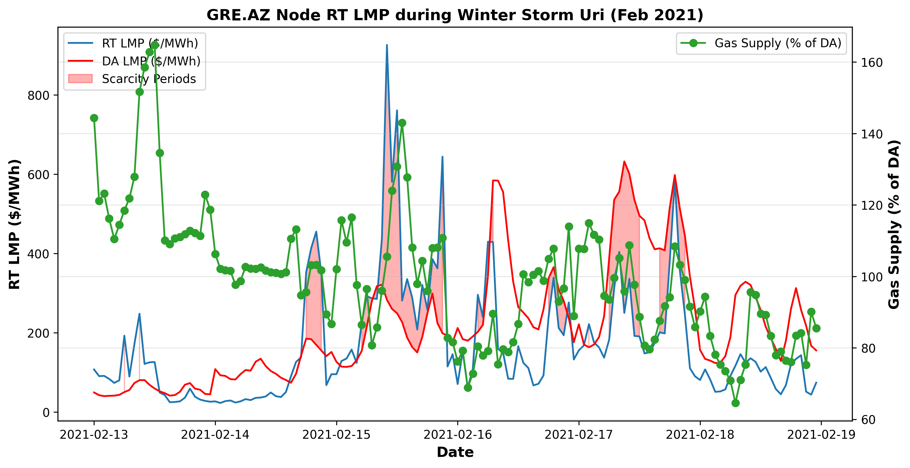

Important and costly lessons were learned as a result of Uri. Since the winter storm Texas and others have made progress winterizing infrastructure so gas pipelines and power generators can be more robust to extreme weather conditions similar to Uri. At the same time utilities are building out renewable energy generation. As mentioned GRE receives 44% of its energy from wind and renewables as of 2024. As we will see below, this played an important role in the very recent Winter Storm Fern lasting from January 21-26, 2026. 

In this case we begin with the GRE.AZ node which represents an aggregation of GRE's physical generation. During Fern temperatures dipped as low as -22°F. The rest of the United States also experience extreme cold. Natural gas prices spike as demand soared, but improved infrastructure kept pipelines operational and blackouts localized. The plot below shows RT prices at GRE.AZ spiking above $2000/MWh and prices hover at or above $500/MWh for well over 24 hours. The green line shows RT wind mix as a percentage of the seasonal average. There is a clear relationship showing wind production dropping close to zero as prices go parabolic in the heart of the cold snap.

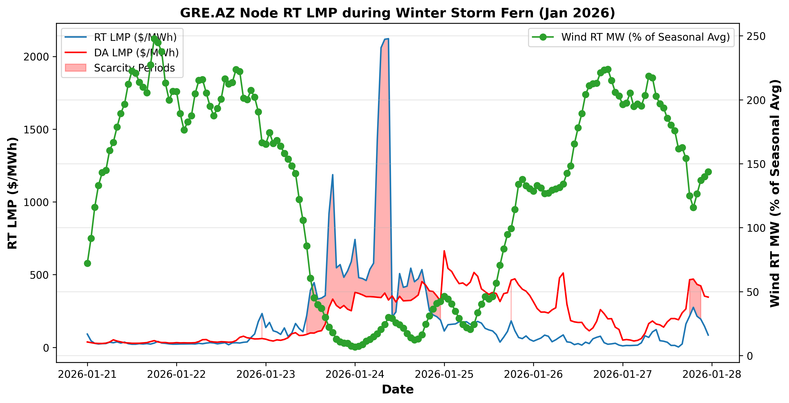

The WAUE node shows a similar trend to its counterpart. Wind drops and prices spike. However, in this case RT prices hovered around $300/MWh and went as high as $1750/MWh. Once again the prices could be catastrophic for market participants forced to buy large amounts of energy in the RT market. 

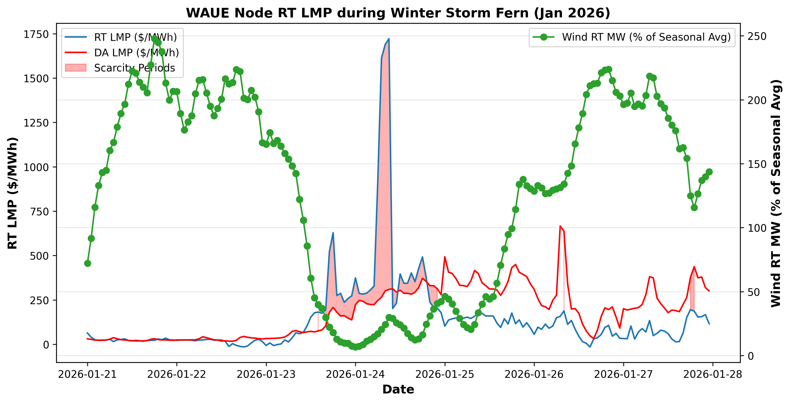

Critically, during Fern prices were consistently more extreme at GRE.AZ (exceeding $2,000/MWh) compared to WAUE (peaking at $1,750/MWh). This divergence - with GRE.AZ prices elevated above WAUE during the exact weather conditions GRE faced the highest operational stress - demonstrates why Great River Energy's WAUE→GRE.AZ FTR proved highly profitable. The next section examines how this FTR captured the price spread during winter 2025-2026.

## Part 3: Examining FTR Profit and Loss for WAUE→GRE.AZ 

Financial Transmission Rights (FTR) are financial instruments that entitle holders to compensation for congestion costs caused by price differences between two points on the grid. The first point is referred to as the source node representing the point where power is injected. The second point is called the sink node which represents the delivery point. FTRs pay the difference between the sink price and the source price, with settlements based on hourly DA LMP. After each hour, the holder receives (or pays) the DA price spread that occurred during that hour. For example, if WAUE (source) settles at $30/MWh and GRE.AZ (sink) settles at $100/MWh the FTR holder receives $70 per MW held by the FTR. If WAUE settled at $120/MWh and GRE.AZ at $100/MWh the FTR holder would pay the $20 per MW difference. FTR are held for a set time period (monthly or quarterly) with specifications for hourly MW and peak vs. off-peak hours. FTR are auctioned in a competitive market where utilities and financial institutions participate. In MISO's annual FTR auction, market participants bid on specific source-to-sink paths for defined time periods. The clearing price represents what the market expects the average hourly price spread to be, plus a risk premium for uncertainty. 

This case study will examine GRE's WAUE→GRE.AZ FTR performance during two contrasting extreme weather events: first, the actual winter 2025-2026 quarter that included Winter Storm Fern, and second, a hypothetical scenario applying the same FTR to the winter quarter containing Storm Uri. These comparisons will illustrate how different failure modes - natural gas infrastructure collapse (Uri) versus wind generation failure (Fern) - create distinct price patterns and FTR profitability profiles.

### Case Study: WAUE→GRE.AZ during Winter 2025-2026

MISO makes public the results of its annual FTR auctions. Per the data, for the 2025 winter season GRE won FTRs for WAUE→GRE.AZ totaling 77 MW during peak hours and 55.6 MW during off-peak. Here is a table summary of the FTR purchases:

| Source | Sink   | Class      | MW   | Clearing Price | Total Cost | Hourly Cost / MW |
|--------|--------|------------|------|----------------|------------|------------------|
| WAUE   | GRE.AZ | Peak       | 77   | 3429           | 264103     | 3.40             |
| WAUE   | GRE.AZ | Off-peak   | 55.6 | 3272           | 181977     | 2.82             |

The total cost of the FTRs was $446,080 which is paid upfront. Upon purchasing the FTR GRE is entitled to spread differences upon settlement. So when the GRE.AZ price is greater than the WAUE price by more than $3.40/MWh during peak hours (or $2.82/MWh during off-peak hours) the FTR is profitable. During normal conditions, these spreads are typically small. However, as we will see, extreme weather events can create spreads of hundreds of dollars per MWh.

The plot below illustrates profit and loss for the FTR. The plot showcases several interesting discoveries. The FTR is immediately and consistently profitable. Leading up to Fern the FTR had already accrued well over $1M in profit. This suggests GRE likely had better insight to its own area (GRE.AZ hub) and expected prices to be consistently higher than the WAUE. When Winter Storm Fern hits the profit accelerates greatly. The data suggests extreme cold paired with low wind created extreme scarcity for GRE.AZ's wind heavy generation mix. WAUE reflects a more diversified fuel mix and prices stayed lower creating a massive spread. As a result the FTR profited over $1M from a single winter event. In total this suggests that GRE entered with a strong understanding of the dynamics at play within its own operating region compared to WAUE and was able to capitalize on the information asymmetry.

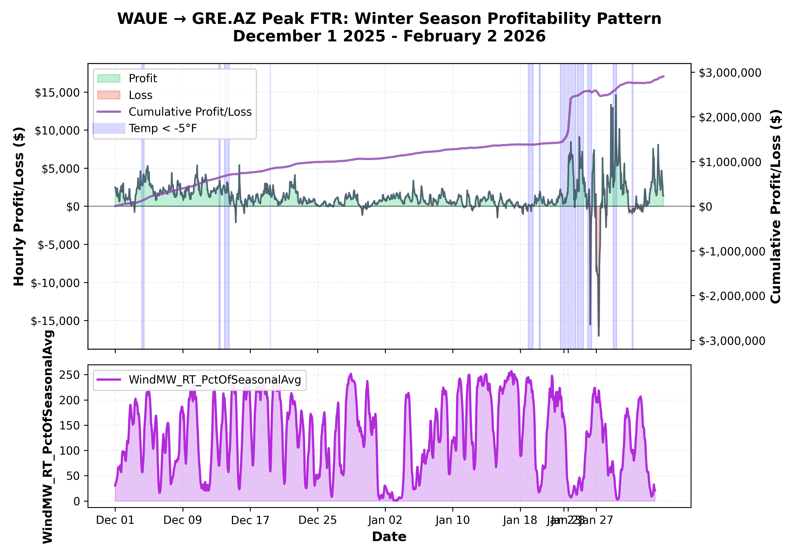

### Case Study: WAUE→GRE.AZ during Winter 2020-2021 (Hypothetical FTR)

In contrast, winter 2020-2021 shows a completely different dynamic. FTR auction data is not available for this year, so we are creating a hypothetical where the same FTR used for winter 2025-2026 was purchased here. In this case the FTR would have consistently lost value meaning prices were generally lower at GRE.AZ than WAUE. The magnitude is smaller as cumulative loss would have been roughly -$300,000 leading into Uri. It is difficult to say why the price spreads under normal conditions are so different in 5 years' time, but this demonstrates that grids are always evolving and congestion patterns change. Uri's defining features were markedly different from Fern causing different price action. As discussed, Uri saw natural gas infrastructure collapse. WAUE interfaces to the MISO-SPP seam where any energy crossing borders would have been exceedingly expensive given the scarcity in both operating areas. Comparatively, while GRE.AZ was constrained like the whole country, it may have been slightly less gas dependent and exhibit the same complications from cross-region scarcity pricing. As an end result the hypothetical FTR loses more than $400,000 during a single winter storm, more than doubling the losses for the entire season.

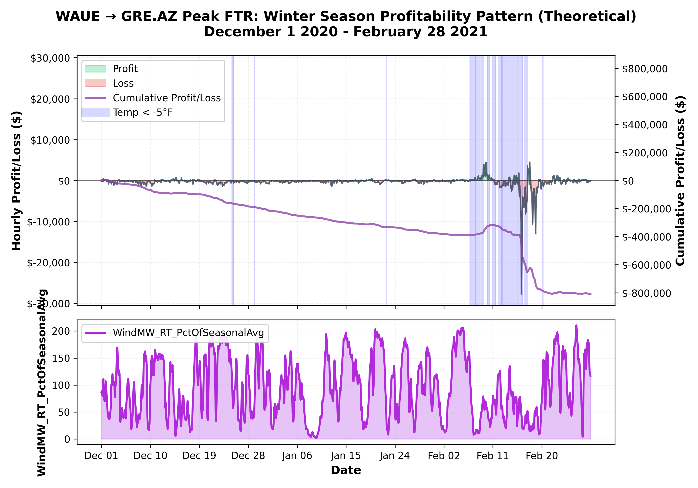

So we have two different extremes with opposite outcomes based on circumstance. There is no guarantee the same strategy will work from one year to the next. Every situation is different, particularly in outlier cases where samples are small and vary in meaningful ways. These differences are a byproduct of a constantly evolving system. Rapid change also calls into question the use traditional risk metrics such as conditional value at risk as we will see below.

### Assessing Conditional Value at Risk 

Conditional value at risk (CVaR) is a risk metric commonly used to assist in the pricing of FTRs. The justification for CVaR is that it helps quantify tail risk by averaging historical worst case scenarios and adjusting prices to reflect that risk. The process to find CVaR for a 95% confidence interval and adjust a naive price goes as follows:

1. Calculate 5th percentile value for historical spreads. This is also called value at risk (VaR).
2. Calculate the average for all values beyond the 5% threshold (CVaR).
3. Calculate mean spread over all historical hours (naive price).
4. Calculate CVaR-adjusted price using (Naive Price)*(95% of hours) - (CVaR)*(100%-95% of hours)

So the suggested CVaR price is equal to the mean spread minus an adjustment for average historical tail risk. The plot below illustrates the CVaR calculation using winter data from 2014 to 2020 (pre-Uri). 

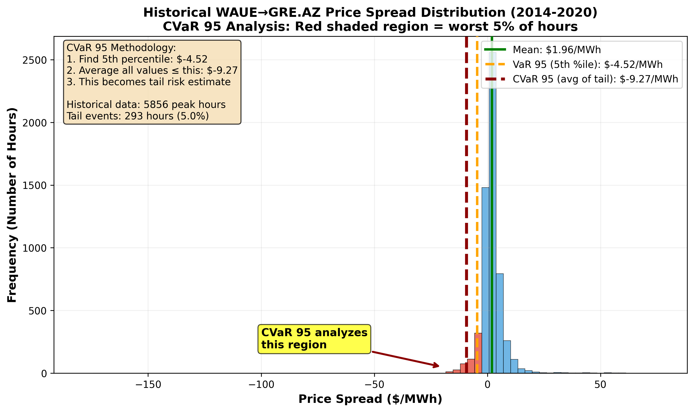

This methodology has worked well historically to price normal tail risk. But as we are about to see it contains underlying assumptions that break down when a new tail event exceeds data from all past events. The plot shows the assumptions violated:

1. The historical 5% CVaR estimate was an average of $-9.27/MWh. Uri season's worst 5% averaged -$74.22/MWh. This is an 8x difference.

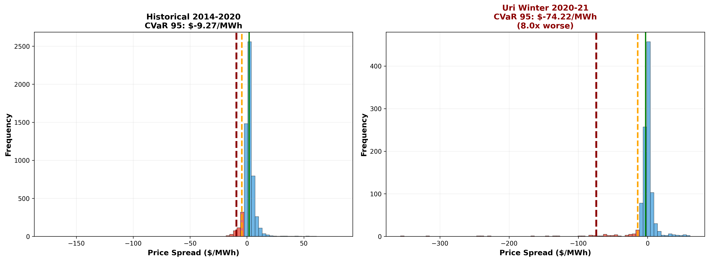

2. The 5% VaR threshold pre-Uri was -$4.90/MWh. 7.5% of hours exceeded this threshold in 2021.

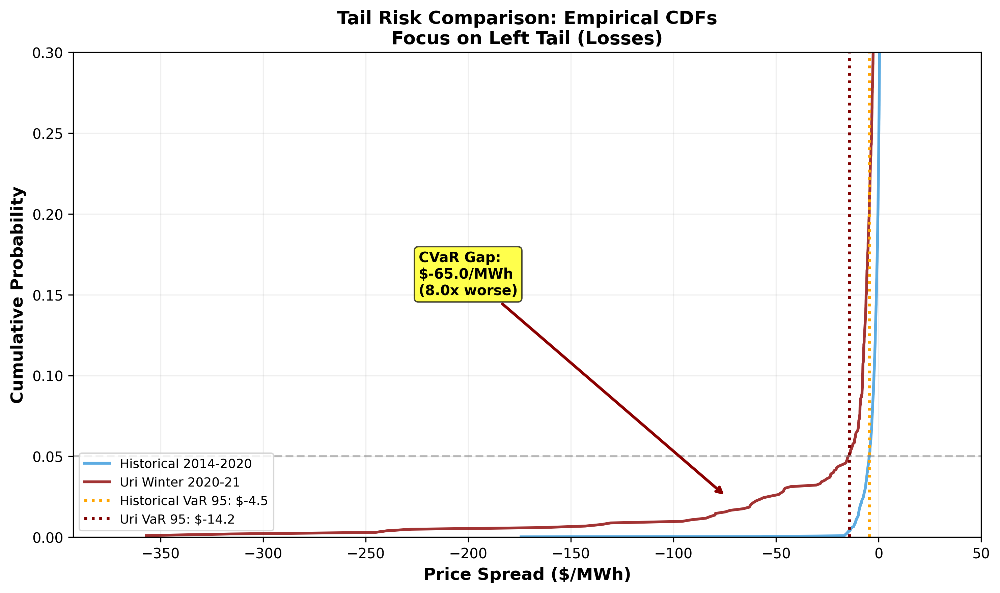

The upshot is that CVaR fails to convey future tail risk because there is no guarantee the worst case event is contained in the historical dataset. Also because tail events are cascading the number of hours exceeding the threshold can be much larger than the 5% confidence interval. This problem is exacerbated by climate change, which is actively fattening the left tail of temperature distributions - making historical data increasingly obsolete for pricing extreme cold events. CVaR serves a purpose to analyze historical risk, baseline expected prices at auction and document it for regulatory purposes. However its implementation should not be viewed as sufficient for capturing risk. It is important to note many people understand that CVaR has limitations, but the demonstration above serves to illustrate why its assumptions fail during tail events. Proper risk management must be more involved. It requires forward-looking scenario analysis, knowledge of physical systems, and recognition that grid dynamics evolve continuously - driven by generation mix changes, transmission upgrades, and climate-induced shifts in weather patterns. From a quantitative perspective scenario analysis is quite appealing as it allows one to simulate and analyze how winter seasons with greater skewness and volatility (as we are witnessing with Minnesota's climate data) can impact profitability.

## Part 4: Discussion of High-Level Implications for Hedging Strategy

The analysis above demonstrates that traditional risk metrics like CVaR, while useful for regulatory reporting and baseline pricing, are fundamentally insufficient for managing tail risk in energy markets. CVaR's backward-looking methodology assumes historical distributions remain stable. This assumption is violated as grid infrastructure evolves and climate patterns shift weather extremes.

Despite these limitations some market participants consistently profit from FTR positions while others face catastrophic losses during the same events. GRE's performance during Winter Storm Fern is a prime example of this divergence. The key question becomes what enables sophisticated participants to succeed where quantitative risk models fall apart? 

GRE's success likely reflects three key advantages that CVaR and less sophisticated participants cannot capture. To be clear the following paragraph is a speculative analysis of what GRE may be doing to capture a competitve advantage in its market. First, local operational knowledge. GRE is a Minnesota-based utility operating which operates and maintains the nodes making up GRE.AZ hub. It will have more granular understanding of regional transmission constraints, generation mix, and demand patterns throughout the season and during extreme weather. This enables GRE to assess the likelihood of scenarios and determine which ones are likely to be profitable (extreme cold paired with wind scarcity) or catastrophic (cross-region natural gas constraints) along the WAUE→GRE.AZ path. Secondly, GRE may perform forward-looking scenario modeling which can inform on the potential impact of such events as a three day stretch of -20°F with 20% wind generation. Thirdly, GRE likely recognizes the implications of structural and climate evolution. While less sophisticated operators may rely more on backward-looking metrics like CVaR, GRE would recognize its assumptions break as generation mix, transmission capacity and congestion patterns change and the climate enters a new regime. These strategic advantages have persisted in part due to the FTR market structure. Research shows that less liquid paths such as WAUE→GRE.AZ have greater pricing inefficiencies than hub-to-hub paths with high liquidity and many bidders【3】. GRE is likely bidding against more participants using CVaR-based pricing and less participants with sophisticated understanding.

The climate analysis presented above compounds CVaR's insufficiency and amplifies the importance of sophisticated methods. Minnesota's climate data show winter temperatures exhibit fattening left tails (more extreme cold). The wind patterns show trends towards more low-wind stretches along with risk of high wind events. Again CVaR will price for yesterday's weather, which is not adequate if the climate is shifting towards more frequent and severe extreme events. GRE also exhibits elements of sophisticated risk management beyond its financial portfolio. In 2024 GRE changed its circuit breaker operating temperature specs from -40°C to -50°C for its entire service territory. -50°C translates to -58°F, which heavily exceeds Minneapolis record cold value of -34°F. This again suggests GRE is thinking carefully and operating for the future rather than looking into the past for answers. The contrast between Winter Storm Fern's profitability and the hypothetical Uri catastrophe for the same FTR path demonstrates that successful tail risk management cannot rely on backward-looking statistical measures alone. As climate change continues to fatten distribution tails and extreme weather patterns evolve beyond historical precedent, the competitive advantage belongs to participants who combine physical system understanding with recognition of structural grid evolution. The future of FTR profitability lies not in refining statistical models of historical prices, but in developing sophisticated physical frameworks that capture the dynamics of an evolving grid shaped by climate change, generation mix transitions, and market evolution.

---
**Data Limitations and Future Analysis**

This analysis necessarily simplifies complex market dynamics and focuses on a single FTR path over limited time periods. A complete hedging strategy would require portfolio-level analysis and assessment of correlated risks across multiple positions. Still, the WAUE→GRE.AZ case study illustrates fundamental principles applicable to broader FTR strategy development.

The analysis is currently retrospective. No forward-looking scenario modeling has been conducted. This is an immediate next step and currently a work in progress.

In addition, several more limitations merit acknowledgment:
- Extreme event sample size (n=2) limits prediction confidence.
- Natural gas pipeline constraint data is not publicly available, requiring proxy measures.
- FTR auction clearing prices reflect aggregated market expectations but individual bidder data was not analyzed.
- Auction Revenue Rights (ARR) allocation not examined due to confidential data. ARR holders receive priorty in auctions, which potentially impacts prices.
- Climate analysis covers 17 years; longer historical data might reveal cyclical patterns vs trends.
- All weather analysis relies on data from KMSP (Minneapolis) weather station.
- Analysis does not account for grid upgrades, outages, or physical constraints beyond those suggested by MISO's fuel mix API.
- Claims about GRE's capabilities were inferred based on FTR outcomes for select nodes over a limited number of seasons.
- Analysis focused exclusively on cold events in Minnesota winter. The analysis did not cover other types of extreme winter weather like ice storms or heavy snowfall. 
- Spring, summer, and fall will exhibit different dynamics and were not analyzed here.

---

## References

1. Brayshaw, D.J., Zhu, L., Coker, P.J., et al. (2024). Severe compound events of 
   low wind and cold temperature for the British power system. Meteorological 
   Applications, 31(4), e2219. https://doi.org/10.1002/met.2219

2. Great River Energy. (2024). 2024 Annual Report: Powering What's Possible. 
   Retrieved from https://greatriverenergy.com/2024-annual-report

3. London Economics International LLC. (2023). Independent Evaluation of MISO's 
  Auction Revenue Rights and Financial Transmission Rights Markets. Prepared for 
  Midcontinent Independent System Operator. 
  https://cdn.misoenergy.org/20230112_LEI%20ARR-FTR%20Market%20Evaluation%20Report627572.pdf

